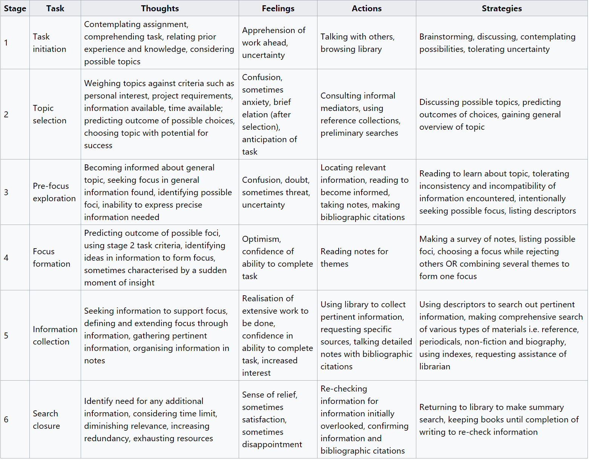

信息检索 
---
> 维基百科文章 [`Information Retrieval`](https://en.wikipedia.org/wiki/Information_retrieval)

> 本文主要参考 [`Information seeking behavior`](https://en.wikipedia.org/wiki/Information_seeking_behavior#Models)

### 搜索过程如下图

---
目前的代码简化了以上步骤，包含：
-[x] 接收检索条件/关键字等信息，并进行初步处理，构建Information、Assignment
    ~~~java
      public interface Information {
      
          /**
           * 定位资源
           */
          URI locate();
      
          /**
           * 绑定资源
           * @param info
           */
          void situate(URI info);
      
      }
    ~~~

-[ ] 关联加载历史记录
-[x] 构建不同类型搜索实体，有下面两个方法：
    * 读取第一步构建Information，进行查找
    * 查找结果完成后，修改Information
  ~~~java
    public interface Individual {
        void summarize(Assignment assignment);
        URI report();
    }
  ~~~

-[ ] 查询出来的结果根据内容，返回不同类型URI字符串，支持类型如下：
    * 数据库记录 
    > `db://jdbc:default/procedure-x?orgid=12345&page=2`
    * 文本文件
    > `file://127.0.0.1/nothing.json`
    * （编码）数据
    > `data:image/png;base64,iVBORw0KGgoAAAANSUhEU==`
    * 网页
    > `http://www.example.com/index.html`
    
 
  

